# Service Catalog Workshop

Welcome to the minimal Service Catalog session. Today we are going dive deeper into how we create an application for the service catalog.

## Workshop Stages

1. Create a Working application deployment.
2. Create a Service Catalog item
3. Tie the two together

## 1. Create a Application deployment

The workload that was chosen for this workshop was something that is relevant to the company and its upcoming workloads - Drupal.

There is an AWS reference deployment for Drupal available [here](https://aws.amazon.com/quickstart/architecture/drupal/).

Due to time constraints (the full deployment takes over 45 minutes due to the cloudfront distribution - the session today will deploy a reduced version of the architecture as described below)

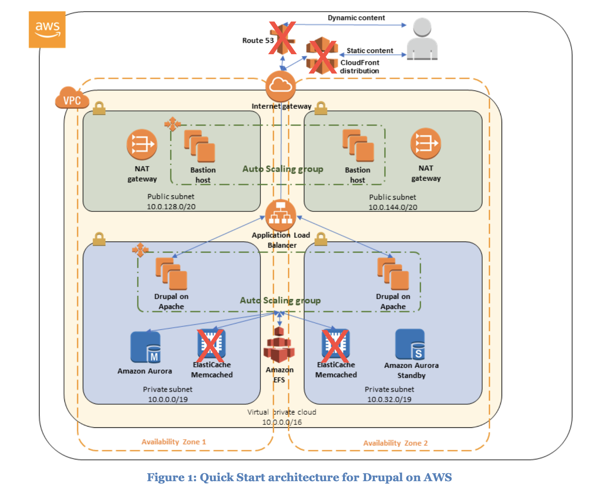

The deployment which is written in [Cloudformation](https://aws.amazon.com/cloudformation/) will perform the following

1. Create a VPC across 2 availability zones - default region is Virginia - `us-east-1`
2. The VPC will include 2 public subnets and 2 private subnets
3. Two NAT Gateways with be deployed in the public subnets
4. An IGW will be attached to the VPC
5. In each of the public subnets, a bastion host will be deployed (for redundancy)
6. An RDS Aurora MySQL instance will be deployed across two availability zones
7. An EFS file system will be deployed in the VPC - and the Drupal instances will use this as their backend storage between the instances
8. An autoscaling group - for the Drupal instances
9. An Application Load Balancer that will front the Drupal application

## Pre-requisites

1. Sign into you AWS account.
2. Go to the EC2 Console
3. Choose Virginia (us-east-1) as your region
4. Create a new key pair
   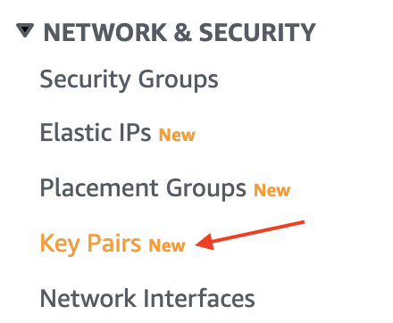
   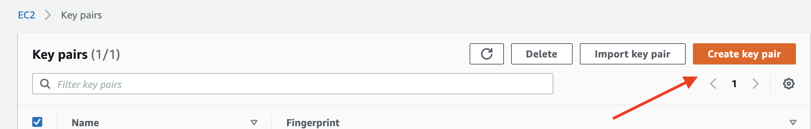
5. Name the key pair   
   Choose the format that suits your needs (pem = Linux / ppk = Windows)
6. Click on Create Keypair
7. The private key will be downloaded to your default location

## Deploy the Drupal Stack
1. Click on the [following link](https://fwd.aws/B3R4x) to start to deploy the Drupal stack above
2. Click on Next
3. Give the Stack a name (for example Drupal)
4. Choose **_exactly two_** availability zones
   
   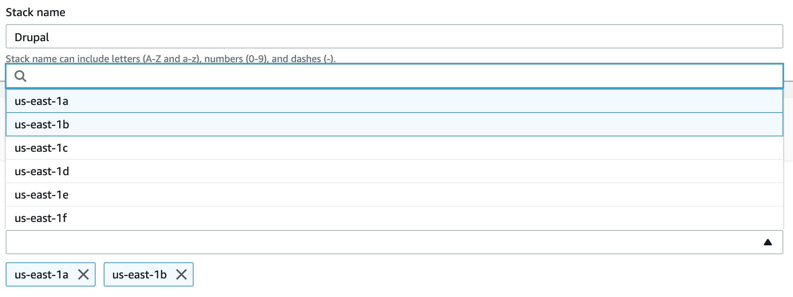
5. Leave the CIDR blocks and subnet configuration defaults
6. Choose the key pair that you create in the previous steps
   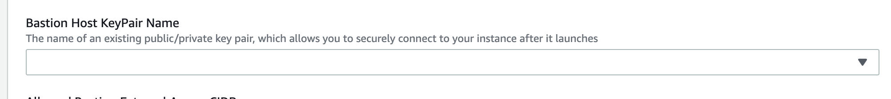
7. For the purpose of this workshop - we will allow access to all IP addresses. In real life this should be scoped to the minimum range possible - usually your company's public IP address range.  
   
   Enter `0.0.0.0/0` for the `Allowed Bastion External Access CIDR`  

   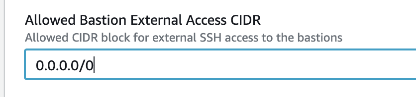 
8. Since we will not be using Route53 - leave the `Route53 Hosted Zone ID` empty  
   
   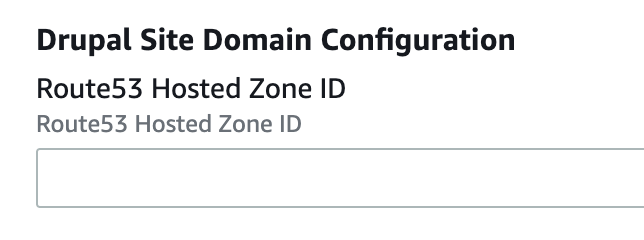
9. Enter a password for your Drupal MySQL database Admin user 

   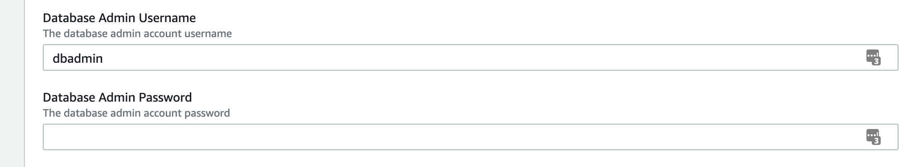
10. Since this will be deployed across multiple availability Zone - leave the `Multi-AZ Database` value as `true`
    
    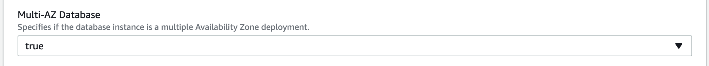
11. Enter a valid email for the `Drupal Site Admin Email`

    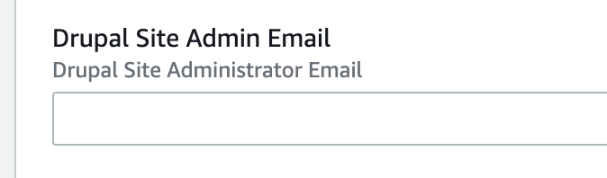
12. Enter a password for your Drupal Administrative Interface 
    
    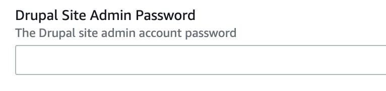
13. Enter a password for your Drupal MySQL application user 
    
    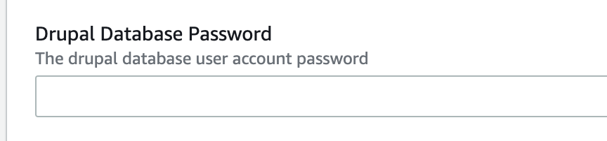
14. Enter an email address for AutoScaling Notifications
    
    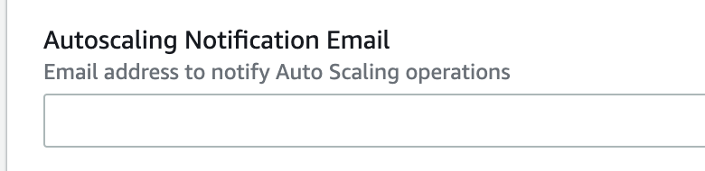
15. Set Elasticache to `false`
    
    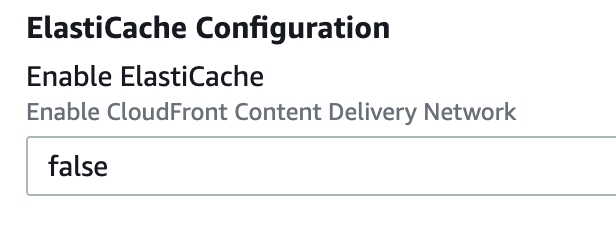
16. Set `Enable Cloudfront` to `false`

    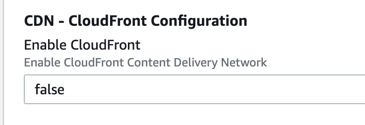
17. Click `Next` at the bottom of the page
18. Click `Next` again at the bottom of the page
19. Check the two boxes to confirm that you allow the creation of IAM roles.

    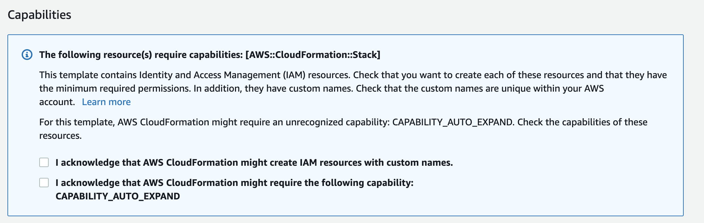
20. Click `Create Stack`

The process can take about 15-20 minutes to complete. If you would like you can go to the [source code](https://github.com/aws-quickstart/quickstart-drupal/tree/master/templates) for this deployment and go through the Cloudformation templates to dive deeper into each of the stacks that are being built.

When the stack has deployed succesfully, you will receive a URL as part of the drupal stack that has completed.

Click on the stack name

Click on Outputs

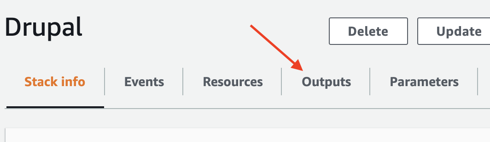

And here you will see the URL of the Elastic Load Balancer that is serving your Drupal deployment.

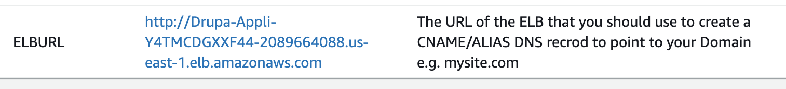

You can log into the Drupal deployment with the credentials you used to deploy the stack above.

> **If you would like you can continue onto the next stage without waiting for the stack to complete.**

## 2. Create a Service Catalog Item