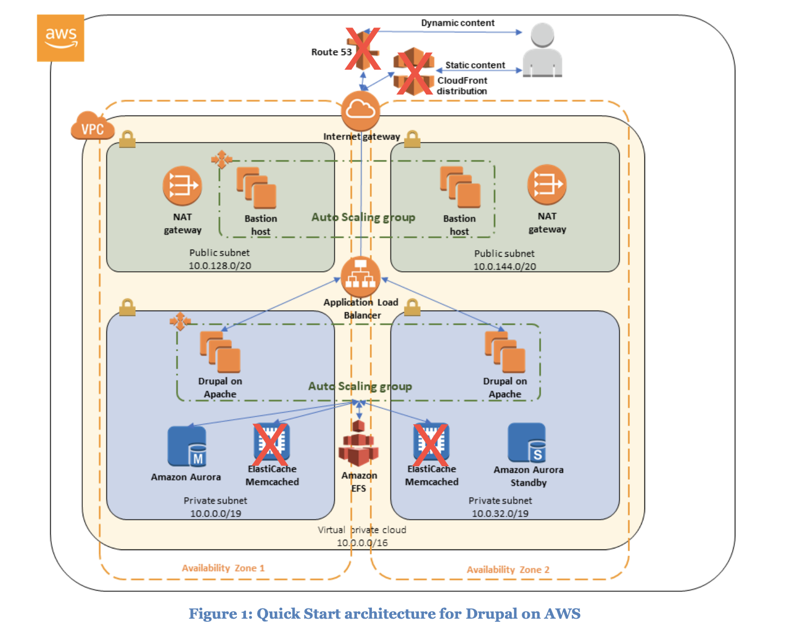

# Service Catalog Workshop

Welcome to the service catalog workshop. Today we are going dive deeper into how we create an application for the service catalog.

## Workshop Stages

1. Create a Working application deployment.
2. Create a Service Catalog item
3. Tie the two together

### Create a Application deployment

The workload that was chosen for this workshop was something that is relevant to the company and its upcoming workloads - Drupal.

There is an AWS reference deployment for Drupal available [here](https://aws.amazon.com/quickstart/architecture/drupal/).

Due to time constraints (the full deployment takes over 45 minutes due to the cloudfront distribution - the session today will deploy a reduced version of the architecture.)

 